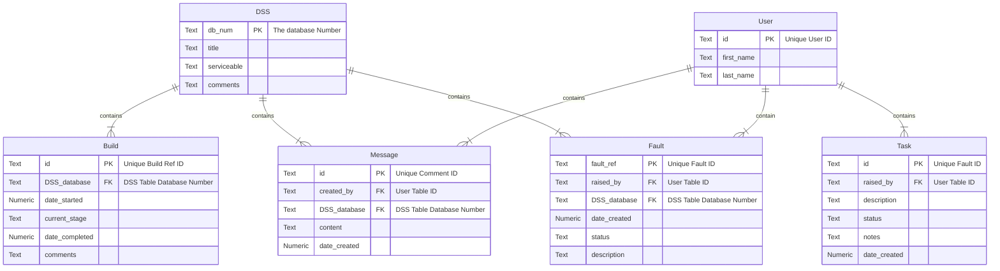

# Status Dashboard
Dashboard application displaying the state of deployable server sets and their core elements.
---
Database schema
---

```mermaid
erDiagram
    DSS ||--|{ Build: contains
    DSS ||--|{ Message: contains
    User ||--|{ Message: contains
    DSS ||--|{ Fault: contains
    User ||--|{ Fault: contain
    User ||--|{ Task: contains
    DSS{
        Text db_num PK "The database Number"
        Text title
        Text serviceable
        Text comments
    }
    User{
        Text id PK "Unique User ID"
        Text first_name
        Text last_name     
    }
    Build {
        Text id PK "Unique Build Ref ID"
        Text DSS_database FK "DSS Table Database Number"
        Numeric date_started
        Text current_stage
        Numeric date_completed
        Text comments
    }
    Message {
        Text id PK "Unique Comment ID"
        Text created_by FK "User Table ID"
        Text DSS_database FK "DSS Table Database Number"
        Text content
        Numeric date_created
    }
    Fault {
        Text fault_ref PK "Unique Fault ID"
        Text raised_by FK "User Table ID"
        Text DSS_database FK "DSS Table Database Number"
        Numeric date_created
        Text status
        Text description
    }
    Task {
        Text id PK "Unique Fault ID"
        Text raised_by FK "User Table ID"
        Text description
        Text status
        Text notes
        Numeric date_created
    }
```
[Status Dashboard](https://www.captureprojects.cc)
