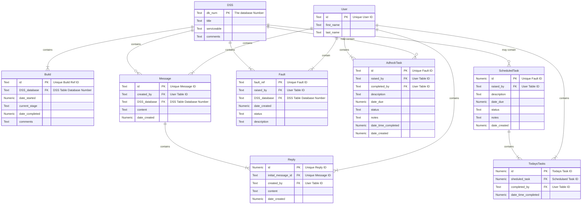

# Status Dashboard
Dashboard application displaying the state of deployable server sets and their core elements.<n/>
---
Database schema
---

---
Database Schema Tasking

---
Database Schema Messaging

